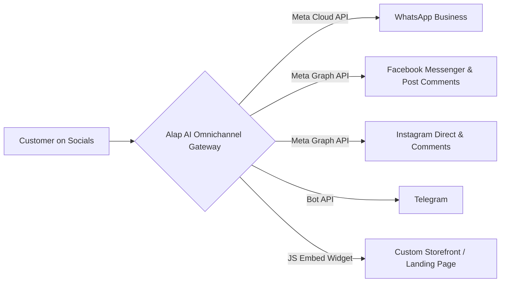
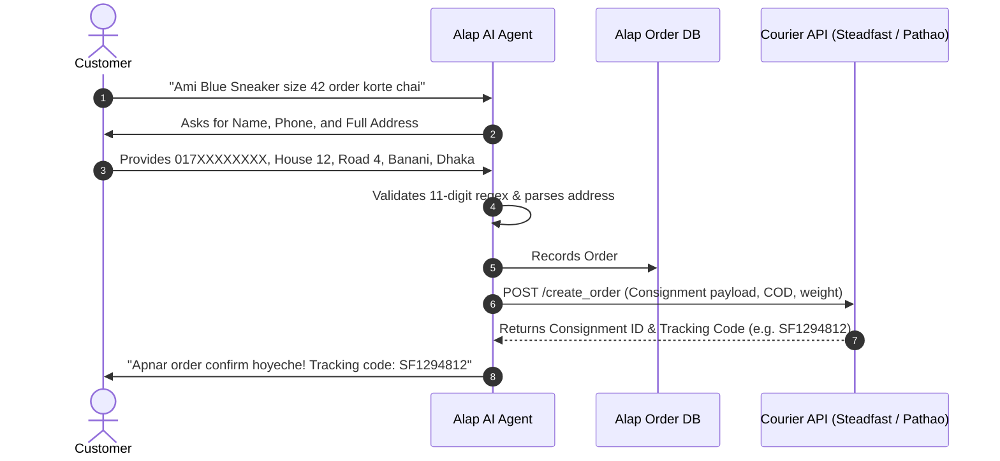
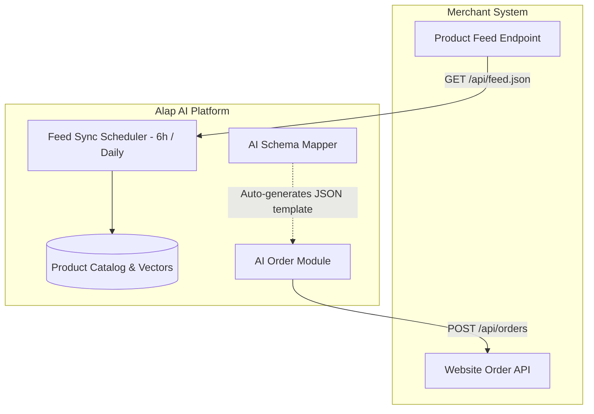

# আলাপ AI (Alap AI) — Complete System Documentation & Architectural Specification

---

## 1. Executive Overview

**আলাপ AI (Alap AI)** (`https://alapai.app`) is an enterprise-grade, omnichannel conversational AI sales and support platform engineered specifically for e-commerce, D2C brands, and social commerce merchants (F-Commerce) in South Asia, with primary specialization in the Bangladeshi market.

Unlike standard rule-based chatbots or generic LLM wrappers, Alap AI functions as an end-to-end autonomous conversational agent. It manages the entire sales funnel—from answering complex customer inquiries in colloquial Bengali and Banglish to matching uploaded product screenshots via Computer Vision, placing orders into merchant ERPs, automating courier bookings (Steadfast, Pathao), and synchronizing conversion telemetry back to Meta Ads Manager.

```
+----------------------------------------------------------------------------------------------------+
|                                         CUSTOMER CHANNELS                                          |
|  [ WhatsApp Business API ]   [ FB Messenger ]   [ Instagram DM ]   [ Telegram ]   [ Web Widget ]  |
+-------------------------------------------------+--------------------------------------------------+
                                                  |
                                                  v
+----------------------------------------------------------------------------------------------------+
|                                       ALAP AI CORE PLATFORM                                        |
|  +---------------------------+  +---------------------------+  +--------------------------------+  |
|  |  Bangla/Banglish NLP Engine|  | Multimodal Vision Engine  |  | Lead / Order Processing Engine |  |
|  |  • Colloquial Bangla      |  | • Catalog Image Matcher   |  | • Address & Phone Validation   |  |
|  |  • Phonetic Banglish      |  | • Warehouse Photo Fetcher |  | • COD & Payment Link Router    |  |
|  +---------------------------+  +---------------------------+  +--------------------------------+  |
|  +---------------------------+  +---------------------------+  +--------------------------------+  |
|  | Multi-Tenant Auth & RBAC  |  | Dynamic Knowledge Base    |  | Branded Invoicing Generator    |  |
|  | (Owner / Moderator Roles) |  | (Vector RAG + CSV Imports)|  | (Bangla / English PDF Engine)  |  |
|  +---------------------------+  +---------------------------+  +--------------------------------+  |
+-------------------------------------------------+--------------------------------------------------+
                                                  |
                                                  v
+----------------------------------------------------------------------------------------------------+
|                                    BACKEND & EXTERNAL ECOSYSTEM                                    |
|  +-----------------------+  +------------------------+  +--------------------+  +---------------+  |
|  |  Courier APIs         |  | E-Commerce Sync        |  | Marketing Engine   |  | Meta CAPI     |  |
|  |  • Steadfast Courier  |  | • Product Feed API     |  | • WhatsApp Broadcast|  | • Server-side |  |
|  |  • Pathao Courier     |  | • Custom Order Webhooks|  | • Automated Groups |  |   Event Sync  |  |
+----------------------------------------------------------------------------------------------------+
```

---

## 2. Platform Architecture & Data Flow

### 2.1 Complete Customer Journey Lifecycle

1. **Discovery / Ad Click:** A prospective buyer clicks an ad or navigates to a merchant page on Facebook, Instagram, or WhatsApp.
2. **Ingress & Intent Classification:** The incoming webhook triggers the Alap AI core. The NLP engine detects language (Bangla script, phonetic Banglish, or English) and classifies intent (product query, stock check, price request, delivery time inquiry, or order request).
3. **Multimodal Product Identification:** If the user uploads a screenshot, the Vision engine matches visual embeddings against the merchant's synchronized product catalog.
4. **Autonomous Conversation & Upselling:** The AI agent answers product questions, offers available sizes/colors, shares unedited real product photos if requested, and guides the customer toward checkout.
5. **Data Extraction & KYC Validation:** The agent extracts and validates:
   - Full recipient name
   - 11-digit Bangladeshi mobile number (`01[3-9]\d{8}`)
   - Detailed delivery address (District, Thana/Area, Street, House/Road)
   - Preferred delivery mode (Home Delivery or Hub Pickup)
6. **Order Placement & Invoicing:** The order is committed to the Alap AI database, synchronized to the merchant's custom website API (if enabled), and a branded PDF invoice is generated.
7. **Logistics Handshake:** The parcel is automatically or semi-automatically dispatched via the Steadfast or Pathao Courier API, generating a tracking code and consignment ID.
8. **Telemetry & Feedback Loop:** A `Purchase` or `QualifiedLead` event is sent to Meta Conversions API (CAPI) to optimize ad targeting.

---

## 3. Detailed Integration Ecosystem

### 3.1 Messaging & Omnichannel Social Integrations



#### A. Official WhatsApp Business API (Meta Tech Provider)
* **Architecture:** Direct integration with Meta Cloud API. Eliminates reliance on unofficial third-party scrapers or bulk-sender tools, guaranteeing 0% phone number ban risk.
* **Capabilities:**
  * Real-time 24/7 AI-driven conversational commerce.
  * Interactive WhatsApp Template Message dispatch for order confirmations, delivery updates, and tracking numbers.
  * Automated WhatsApp marketing campaigns with built-in opt-out compliance (Stop Message handling).

#### B. Facebook Messenger & Page Engagement
* **Direct Messages (DM):** Autonomous handling of all private Messenger inquiries.
* **Public Post / Ad Comment Automation:**
  * **Public Reply:** AI replies to post/ad comments immediately.
  * **Private DM Reply:** AI automatically initiates a private inbox message to commenters with catalog links and purchase guidance.

#### C. Instagram Direct & Comments
* Auto-responds to Instagram Direct Messages (DMs), Story Mentions, and post comments.

#### D. Telegram Bot Integration
* Webhook-connected bot handling customer interactions, order tracking, and FAQ responses.

#### E. Website Chat Widget
* Lightweight JavaScript embed snippet (`<script src="https://alapai.app/widget.js" ...></script>`).
* Supports multi-domain origin whitelisting (both apex and `www` subdomains, e.g., `brand.com` and `www.brand.com`).

---

### 3.2 Logistics & Courier Integrations (Bangladesh)

Alap AI features deep native integrations with Bangladesh's premier courier services:



#### A. Steadfast Courier API Integration
* **Authentication:** API Key and Secret Key headers.
* **Order Dispatch:** Automates parcel creation with recipient name, 11-digit phone number, address, Cash on Delivery (COD) amount, and item description.
* **Delivery Modes:** Supports **Home Delivery** and **Hub Pickup**.
* **Status Polling:** Real-time polling and webhook synchronization for parcel states (`in_review`, `delivered`, `partial_delivered`, `cancelled`, `returned`).

#### B. Pathao Courier API Integration
* **Authentication:** OAuth2 Client ID, Client Secret, Merchant Email, and Password with automated token refresh.
* **Store Management:** Multi-store pickup location mapping and dynamic store ID selection.
* **Delivery Types:** Standard Delivery and On-Demand Delivery with configurable weight (kg) tiers.
* **Sandbox & Live Environments:** Toggleable sandbox testing mode before production rollout.

---

### 3.3 E-Commerce Storefront & Custom Backend APIs

For merchants running custom Laravel, Node.js, Next.js, WordPress/WooCommerce, or Shopify storefronts, Alap AI provides bidirectional synchronization.



#### A. Product Feed API (JSON Endpoint)
* Exposes merchant catalog via a single authenticated JSON endpoint (`API Key` or `Bearer Token`).
* Automated sync frequency: **Every 6 hours** or **Daily**.
* Synchronizes product titles, descriptions, SKU, categories, prices, discounts, stock availability, and image gallery URLs.

#### B. Website Order API
* Enables the AI agent to push confirmed orders straight to the merchant's proprietary database or checkout engine.
* **Modes Supported:**
  * **Cash on Delivery (COD):** The agent collects information, validates the order, and dispatches the payload to the merchant endpoint.
  * **Payment Link (Pay Online):** The merchant endpoint returns a dynamic payment gateway URL (e.g., bKash / SSLCommerz / Shurjopay), which the AI sends directly in chat.
* **Advanced Transport Features:**
  * Custom HTTP headers (JSON format).
  * `Idempotency-Key` header support to prevent duplicate order generation during network timeouts.
  * Custom endpoint path variables (e.g., `/orders/create`, `/orders/{order_id}/status`, `/health`).
* **✨ AI-Powered Schema Mapper:** Merchants can paste their raw API documentation or sample `curl` command. Alap AI’s schema AI automatically parses the spec, drafts the JSON body template with `{{tokens}}`, maps the response keys, and validates it against sample order payloads.

---

### 3.4 Meta Conversions API (CAPI) Integration

To solve signal loss caused by browser privacy restrictions, Alap AI provides server-side ad attribution.

* **Event Pipeline:** Automatically dispatches server-side events directly to Meta Events Manager:
  * `Lead`: Triggered upon capturing a verified customer phone number.
  * `QualifiedLead`: Triggered when customer intent exceeds the configurable AI confidence threshold.
  * `Purchase / OrderPlaced`: Triggered upon finalized order confirmation with real or fallback order deal values.
* **Optimization Benefit:** Feeds high-intent behavioral data back to Meta’s ad delivery algorithm, lowering Cost Per Acquisition (CPA) on Click-to-WhatsApp and Click-to-Messenger campaigns.
* **Setup & Guardrails:** Includes a built-in pre-flight setup check, Test Event Code validator (`TESTXXXX`), and automated 30-day health telemetry (Sent / Failed / Skipped).

---

## 4. Deep Feature Analysis & AI Capabilities

### 4.1 Specialized Bangla, Banglish & English NLP
* **Trilingual Fluency:** Seamlessly interprets pure Bengali script (*"ভাই এই নীল রঙের স্নিকারটা কি ৪২ সাইজে এভেইলেবল আছে?"*), phonetic Banglish (*"vai ei blue runner size 42 available ache? price koto?"*), and standard English.
* **Colloquial & Dialectal Robustness:** Handles local expressions, polite phrasing, abbreviations, and informal grammatical structures typical in Bangladeshi online commerce.
* **Brand Persona Customization:** Merchants configure system prompts, tone of voice (enthusiastic, professional, friendly), customer service policies, and safety guardrails.

### 4.2 Multimodal Vision AI Engine
* **Customer Image Recognition:** Customers frequently send screenshots of Facebook/Instagram posts or cropped catalog photos. The vision engine detects the product and extracts its SKU and attributes.
* **Real & Raw Product Gallery:** Upon customer request (*"Asol chobi dekhte chai"* / *"Real picture ache?"*), the agent pulls and shares unedited warehouse/stock photos, reducing return rates (RTO).

### 4.3 Automated WhatsApp Marketing Campaigns
* **Segmented Broadcasts:** Pre-configured high-converting customer segments:
  1. *Bought in the last 30 days* (Upsell & cross-sell)
  2. *Bought before, gone quiet* (Win-back / re-engagement)
  3. *Top spenders* (VIP offers & loyalty rewards)
  4. *Asked but never ordered* (Abandoned cart / lead recovery)
  5. *Custom uploaded CSV list*
* **Compliance & Deliverability:** Meta template compliance checker prevents template rejections. Includes automatic 1-tap opt-out buttons ensuring number safety.
* **Instant AI Conversion Handoff:** When a recipient replies to a broadcast, the AI agent immediately takes over the active conversation, displays requested items, and secures the order.

### 4.4 Automated Bangla Invoicing Engine
* Generates downloadable and printable PDF invoices.
* **Configurable Parameters:**
  * Merchant business logo and branding colors.
  * Custom invoice prefix (e.g., `ALAP-1001`).
  * Itemized product breakdown (SKU, description, quantity, unit rate, total).
  * Discount lines, delivery charges, subtotal, and grand total.
  * Custom terms & conditions and footer notes in Bangla or English.

### 4.5 Multi-Tenant RBAC & Team Permissions
* **Owner Role:** Full access to financial billing, API keys, courier credentials, team management, and global persona configurations.
* **Moderator Role:** Restricted access designed for human support staff. Granular permission switches per section:
  * Inbox & Live Chat Monitoring
  * Order Management
  * Lead Pipeline
  * Comments Management
  * Product Catalog & Knowledge Base
  * *Integrations, Billing, and Team configuration are strictly hidden/locked.*

---

## 5. API Reference & Contract Specifications

### 5.1 Product Feed JSON Contract
Merchants hosting a product catalog feed must expose the following JSON structure:

```json
{
  "version": "1.0",
  "currency": "BDT",
  "products": [
    {
      "id": "PROD-101",
      "title": "Blue Runner Sneaker",
      "description": "Premium breathable lightweight running shoes.",
      "category": "Footwear",
      "price": 2650.00,
      "sale_price": 2450.00,
      "in_stock": true,
      "stock_quantity": 45,
      "variants": [
        { "sku": "BR-40", "size": "40", "color": "Blue", "price": 2450.00, "in_stock": true },
        { "sku": "BR-42", "size": "42", "color": "Blue", "price": 2450.00, "in_stock": true }
      ],
      "images": [
        "https://yourshop.com/media/products/blue_runner_main.jpg",
        "https://yourshop.com/media/products/blue_runner_raw_warehouse.jpg"
      ],
      "tags": ["shoes", "sneakers", "sports", "running"]
    }
  ]
}
```

### 5.2 Website Order API Dispatch Payload
When an order is finalized in chat, Alap AI delivers the following POST request:

```json
{
  "event": "order.created",
  "idempotency_key": "alap_ord_8f94e19b-7342-4912",
  "timestamp": "2026-08-31T00:15:30Z",
  "channel": "whatsapp",
  "channel_user_id": "+8801715251562",
  "customer": {
    "name": "Tanvir Ahmed",
    "phone": "01712345678",
    "secondary_phone": "01812345678",
    "address": {
      "full_address": "House 14, Road 7, Block C, Mirpur-2, Dhaka",
      "district": "Dhaka",
      "area": "Mirpur",
      "delivery_type": "home"
    }
  },
  "order": {
    "items": [
      {
        "product_id": "PROD-101",
        "sku": "BR-42",
        "title": "Blue Runner Sneaker",
        "quantity": 1,
        "unit_price": 2450.00,
        "total_price": 2450.00
      }
    ],
    "subtotal": 2450.00,
    "discount": 0.00,
    "delivery_charge": 80.00,
    "total_amount": 2530.00,
    "payment_method": "cod",
    "notes": "Please call before delivery."
  }
}
```

---

## 6. Pricing & Subscription Model

Alap AI operates on a **per-conversation pricing structure**. A conversation is defined as one full customer engagement session (including all multi-turn exchanges within 24 hours).

| Feature / Tier | Free Trial | Starter Plan | Pro Plan (Most Popular) |
| :--- | :--- | :--- | :--- |
| **Monthly Price** | **৳ 0** *(one-time)* | **৳ 299** / month | **৳ 999** / month |
| **Conversations Included** | **100** *(never expires)* | **250** / month | **900** / month |
| **Per-Message Charges** | ৳ 0 (Unlimited messages per chat) | ৳ 0 (Unlimited messages per chat) | ৳ 0 (Unlimited messages per chat) |
| **Supported Channels** | All Channels | All Channels | All Channels |
| **Order Placement in Chat** | Yes | Yes | Yes |
| **Lead Capture with Phone** | Yes | Yes | Yes |
| **Alap AI Branding** | Included | **Removed** | **Removed** |
| **Auto Courier Booking** | Manual | Manual | **Automated (Steadfast & Pathao)** |
| **Comment Auto-Reply (Ads & Posts)**| No | Limited | **Full Automation (DM + Comment)** |
| **WhatsApp Marketing Campaigns** | No | No | **Full Broadcast Engine** |
| **Branded Bangla Invoices** | Basic | Standard | **Full Custom Logo & Terms** |
| **Meta CAPI Ad Optimization** | No | Optional Add-on | **Fully Enabled** |
| **Human Handoff & Moderator RBAC**| 1 Seat | 2 Seats | **Unlimited Seats** |

---

## 7. Comparative Analysis: Alap AI vs. Traditional Solutions

```
+----------------------------------------------------------------------------------------------------+
| Feature Comparison                     | Traditional Chatbots   | Manual Page Admins | Alap AI     |
+----------------------------------------------------------------------------------------------------+
| 24/7 Instant Response Time (<3s)       | Yes                    | No (Sleep/Breaks)  | Yes         |
| Bangla, Banglish & English Fluency     | Poor (Fails on Slang)  | High               | High (AI)   |
| Image & Screenshot Recognition (Vision)| No                     | High               | High (AI)   |
| End-to-End In-Chat Order Placement    | No (Redirects to Web)  | High (Manual)      | High (Auto) |
| Steadfast & Pathao Courier Auto-Book   | No                     | Manual Data Entry  | Yes (1-Click|
| Meta CAPI Conversion Telemetry         | No                     | No                 | Yes         |
| Monthly Cost                           | High ($50-$200/mo)     | ৳12,000 - ৳20,000  | ৳299 - ৳999 |
+----------------------------------------------------------------------------------------------------+
```

---

## 8. Summary & Next Steps

Alap AI represents a purpose-built, high-conversion conversational commerce engine for the Bangladeshi e-commerce landscape. By uniting **Bangla-native language processing**, **multimodal catalog vision**, **direct courier fulfillment**, and **Meta advertising loops**, it enables merchants to operate 24/7 sales operations at a fraction of the cost of manual moderation teams.
