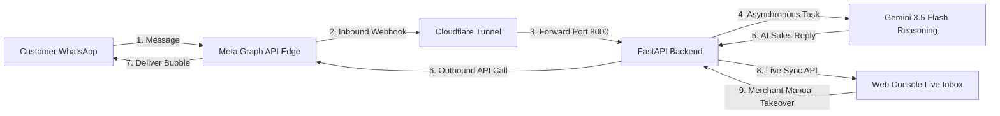

# AriseSell — Complete Meta WhatsApp Cloud API Integration Guide
**Document Version:** 1.0.0  
**Last Updated:** September 4, 2026  
**System:** AriseSell Omnichannel Autonomous E-Commerce Engine  

---

## 📑 Table of Contents
1. [Executive Summary & Architecture Overview](#1-executive-summary--architecture-overview)
2. [Meta Developer & WhatsApp Business Configuration](#2-meta-developer--whatsapp-business-configuration)
3. [Cloudflare Tunnel & Webhook Architecture](#3-cloudflare-tunnel--webhook-architecture)
4. [Backend Webhook Ingestion & WhatsApp User ID Resolution](#4-backend-webhook-ingestion--whatsapp-user-id-resolution)
5. [AI Sales & Reasoning Engine (Google Gemini 3.5 Flash)](#5-ai-sales--reasoning-engine-google-gemini-35-flash)
6. [Web Dashboard Live Inbox & Merchant Takeover](#6-web-dashboard-live-inbox--merchant-takeover)
7. [Step-by-Step Production Startup & Runbook](#7-step-by-step-production-startup--runbook)
8. [Troubleshooting & Common Edge Cases](#8-troubleshooting--common-edge-cases)

---

## 1. Executive Summary & Architecture Overview

AriseSell connects Bangladeshi e-commerce merchants directly to their customers via WhatsApp. When a customer sends a query (in Bengali, English, or Banglish), the system:
1. Ingests the inbound webhook event from Meta's global edge servers in `<10ms`.
2. Resolves customer identity, contact details, and session state.
3. Uses **Google Gemini 3.5 Flash** with custom e-commerce system prompts to reason over product catalog, pricing, and delivery fees (৳80 Dhaka, ৳130 Outside Dhaka, Cash on Delivery).
4. Dispatches the conversational sales response back through Meta Cloud API.
5. Displays the conversation live in the AriseSell Web Dashboard (`/console/inbox`) allowing merchants to monitor conversations or take over manually at any moment.



---

## 2. Meta Developer & WhatsApp Business Configuration

### 2.1 Registered App & Business Credentials
* **Meta Developer App:** `AriseSell_Test2`
* **App ID:** `27675542315480128`
* **App Secret:** `b28751575c04f7708e68091605beb6b8`
* **WhatsApp Business Account (WABA) ID:** `1582068046655602`
* **Phone Number ID:** `1347464985106645`
* **Registered Business Number:** `+880 1401-411091` (`CONNECTED`, Tier 250)
* **Webhook Verify Token:** `arisesell_secure_token_2026`

### 2.2 App Publishing & Going Live
To allow any customer in Bangladesh or worldwide to message your WhatsApp bot without adding them as test numbers:
1. Navigate to **Meta Developer Portal** $\rightarrow$ `AriseSell_Test2` $\rightarrow$ **App Settings** $\rightarrow$ **Basic**.
2. Provide an active, publicly accessible **Privacy Policy URL** (e.g. `https://www.researchtrack.tech/privacy` or `https://alapai.app/privacy`).
3. Set **Category** to `Business and Pages`.
4. Switch the top toggle from **App Mode: Development** $\rightarrow$ **App Mode: Live (Published)**.

### 2.3 Permanent Access Token Generation
For uninterrupted 24/7 background operation:
1. Go to **Meta Business Suite** $\rightarrow$ **Business Settings** $\rightarrow$ **System Users**.
2. Create or select a System User with Admin access.
3. Assign Asset: `AriseSell_Test2` and WABA `1582068046655602`.
4. Generate a **Never-Expiring System User Access Token** with permissions:
   * `whatsapp_business_messaging`
   * `whatsapp_business_management`
5. Place this token in `.env` and `backend/.env` under `META_PAGE_ACCESS_TOKEN`.

---

## 3. Cloudflare Tunnel & Webhook Architecture

Meta requires an **HTTPS webhook URL** accessible from the public internet with a valid SSL certificate.

### 3.1 Running the Cloudflare Tunnel
Run the following command to expose your local FastAPI server:
```powershell
cloudflared.exe tunnel --url http://127.0.0.1:8000
```
* **Example Public URL:** `https://oliver-diagram-surplus-lyrics.trycloudflare.com`
* **Complete Webhook URL:** `https://oliver-diagram-surplus-lyrics.trycloudflare.com/api/v1/webhooks/whatsapp`

### 3.2 Meta Webhook Subscription Configuration
In **WhatsApp** $\rightarrow$ **Configuration** on Meta Developer Portal:
* **Callback URL:** `https://<YOUR_TUNNEL_DOMAIN>/api/v1/webhooks/whatsapp`
* **Verify Token:** `arisesell_secure_token_2026`
* **Webhook Fields Subscribed:** `messages`

---

## 4. Backend Webhook Ingestion & WhatsApp User ID Resolution

### 4.1 Zero-Timeout Ingestion Architecture
To prevent Meta's 5-second HTTP timeout and ensure instant response:
1. Inbound requests to `POST /api/v1/webhooks/whatsapp` validate HMAC signatures and immediately return `HTTP 200 OK` in `<10ms`.
2. Heavy computation (Gemini AI turn, database lookups, and outbound API calls) is scheduled asynchronously using FastAPI `BackgroundTasks`.

### 4.2 Handling WhatsApp Username & `user_id` (`wa_id`)
When a customer has a custom WhatsApp username or User ID, Meta sends the payload with `from_user_id` and places the phone number in `contacts[].wa_id` rather than `messages[].from`.

The parser handles both standard numbers and username accounts seamlessly:
```python
contacts = value.get("contacts", [])
contacts_map = {c.get("user_id"): c.get("wa_id") for c in contacts if c.get("wa_id")}
default_wa_id = contacts[0].get("wa_id") if contacts else None

for msg in messages:
    from_num = msg.get("from")
    if not from_num:
        from_user_id = msg.get("from_user_id")
        from_num = contacts_map.get(from_user_id) or default_wa_id
```

---

## 5. AI Sales & Reasoning Engine (Google Gemini 3.5 Flash)

### 5.1 Dialect Detection & Mirroring
The AI engine (`backend/app/services/ai_engine.py`) detects the language format:
* **Bangla Script:** Responds in polite, natural Bengali script.
* **Phonetic Banglish:** Mirrors customer's Banglish phrasing.
* **English:** Responds in fluent English.

### 5.2 Bangladeshi E-Commerce Business Rules
* **Delivery Fees:**
  * Inside Dhaka: **৳80**
  * Outside Dhaka: **৳130**
* **Payment Methods:** Cash on Delivery (COD), bKash, Nagad.
* **Catalog Reasoning:** Understands variations, sizes, colors, and stock for Jamdani, Taat, Cotton Sarees, Panjabis, and Lifestyle goods.

---

## 6. Web Dashboard Live Inbox & Merchant Takeover

Merchants manage all customer interactions through the unified web console at `http://localhost:3000/console/inbox` (or `/console/threads`).

### 6.1 Real-Time Live Sync
* The frontend regularly syncs active threads via `GET http://localhost:8000/api/v1/threads/live`.
* Live customer queries and AI replies appear dynamically at the top of the queue without manual page reloads.

### 6.2 Manual Merchant Outbound Messaging
* **Composer Box:** Merchants can type custom messages in the reply input.
* **Dispatch:** Clicking **Send $\rightarrow$** or pressing **Enter** dispatches `POST http://localhost:8000/api/v1/threads/live/reply`.
* **Instant Delivery:** The message is sent to the customer's WhatsApp via Meta Cloud API and displayed as an iris-colored `MERCHANT · HUMAN` message bubble.
* **Take Over / Return to AI:** Merchants can toggle between AI-managed and Human-managed conversation modes with a single click.

---

## 7. Step-by-Step Production Startup & Runbook

### Step 1: Start the FastAPI Backend
```powershell
cd "e:\Ship Studio\next-product-2\backend"
.\.venv-next\Scripts\python.exe -u -m uvicorn app.main:app --port 8000 --host 127.0.0.1
```

### Step 2: Start Cloudflare Tunnel
```powershell
& "C:\Program Files (x86)\cloudflared\cloudflared.exe" tunnel --url http://127.0.0.1:8000
```

### Step 3: Start Next.js Frontend Dashboard
```powershell
cd "e:\Ship Studio\next-product-2\frontend"
npm run dev
```

### Step 4: Open Dashboard
Open your browser and navigate to:
👉 **`http://localhost:3000/console/inbox`**

---

## 8. Troubleshooting & Common Edge Cases

| Issue / Symptom | Root Cause | Solution |
| :--- | :--- | :--- |
| **Double grey ticks on WhatsApp, no reply received** | SIM card `01401411091` was active in phone WhatsApp app or testing to same number. | Delete personal WhatsApp account on business SIM so Meta Cloud API owns the number. Test from a different phone number. |
| **Webhooks returning 504 Gateway Timeout** | Synchronous/blocking code in webhook handler. | Ensure `BackgroundTasks` is used and webhook handler returns in `<10ms`. |
| **Meta Graph API error `131026` / Undeliverable** | 24-hour customer service window expired or phone tier issue. | Customer must initiate conversation or merchant must use an approved WhatsApp Template. |
| **Send button not sending from Web Dashboard** | Missing live reply endpoint or unmounted router. | Verify `POST /api/v1/threads/live/reply` is reachable and CORS headers allow `http://localhost:3000`. |

---
*Documentation prepared for AriseSell by Google DeepMind Antigravity Pair Programming System.*
